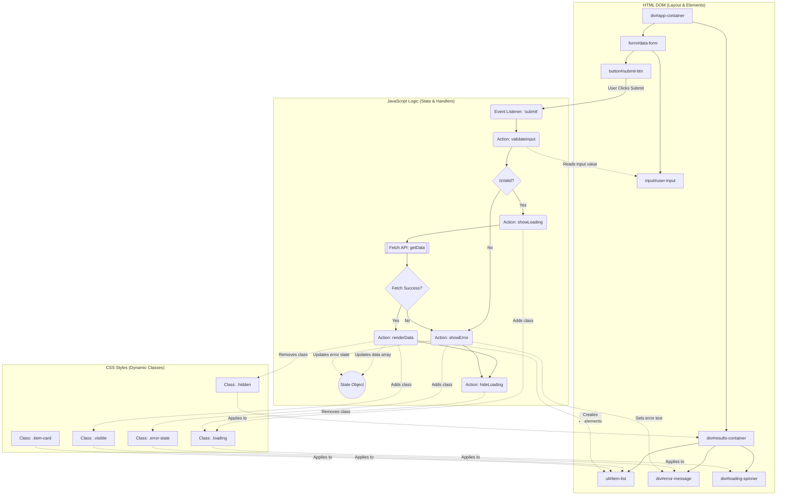

```mermaid
flowchart TD
    subgraph HTML_DOM ["HTML DOM (Layout & Elements)"]
        A1[div#app-container] --> A2[form#data-form]
        A2 --> A3[input#user-input]
        A2 --> A4[button#submit-btn]
        A1 --> A5[div#results-container]
        A5 --> A6[ul#item-list]
        A5 --> A7[div#error-message]
        A5 --> A8[div#loading-spinner]
    end

    subgraph JS_Logic ["JavaScript Logic (State & Handlers)"]
        B1((State Object))
        B2(Event Listener: 'submit')
        B3(Action: validateInput)
        B4{IsValid?}
        B5(Action: showLoading)
        B6[[Fetch API: getData]]
        B7{Fetch Success?}
        B8(Action: renderData)
        B9(Action: showError)
        B10(Action: hideLoading)
    end

    subgraph CSS_Styling ["CSS Styles (Dynamic Classes)"]
        C1[Class: .hidden]
        C2[Class: .visible]
        C3[Class: .loading]
        C4[Class: .error-state]
        C5[Class: .item-card]
    end

    %% Interaction Flow
    A4 -- "User Clicks Submit" --> B2
    B2 --> B3
    B3 --> B4

    %% Validation Logic Flow
    B4 -- Yes --> B5
    B4 -- No --> B9

    %% Fetch Logic Flow
    B5 --> B6
    B6 --> B7
    B7 -- Yes --> B8
    B7 -- No --> B9

    %% Post-Fetch Cleanup
    B8 --> B10
    B9 --> B10

    %% JS to CSS Class Manipulation
    B5 -. "Adds class" .-> C3
    B10 -. "Removes class" .-> C3
    B9 -. "Adds class" .-> C4
    B8 -. "Removes class" .-> C1
    B8 -. "Adds class" .-> C2

    %% CSS Class effects on DOM
    C3 -. "Applies to" .-> A8
    C4 -. "Applies to" .-> A7
    C1 -. "Applies to" .-> A5
    C2 -. "Applies to" .-> A6
    C5 -. "Applies to" .-> A6

    %% JS Direct DOM Manipulation
    B8 -. "Creates <li> elements" .-> A6
    B9 -. "Sets error text" .-> A7

    %% State Updates
    B8 -. "Updates data array" .-> B1
    B9 -. "Updates error state" .-> B1
    B3 -. "Reads input value" .-> A3
```
