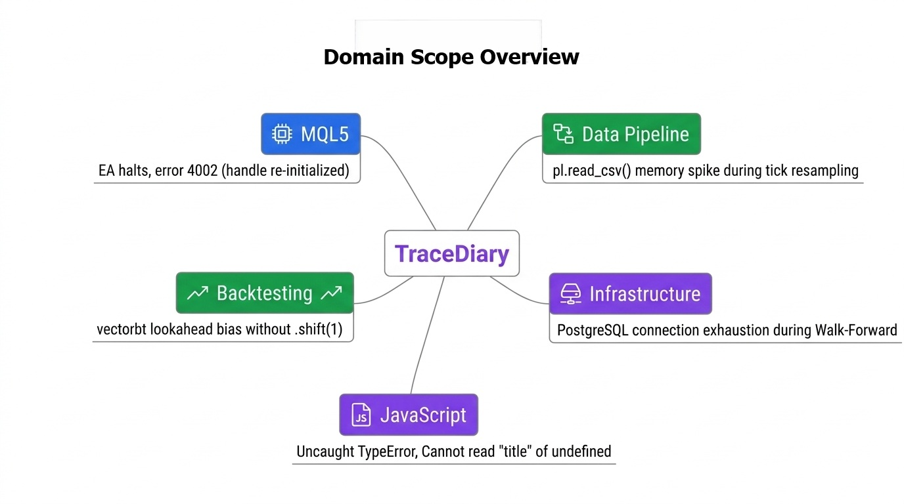
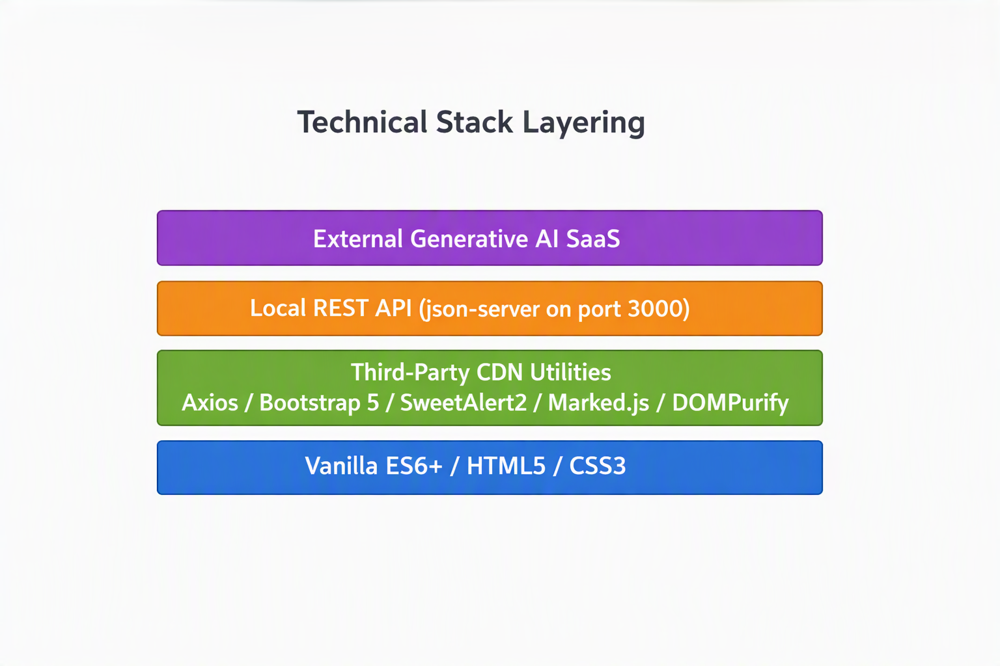
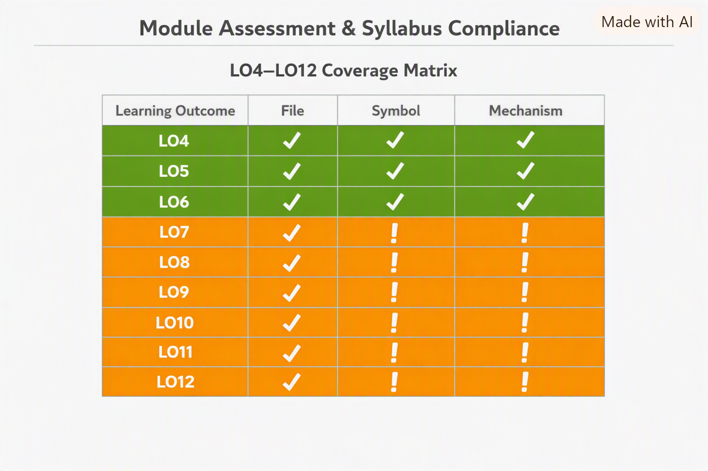
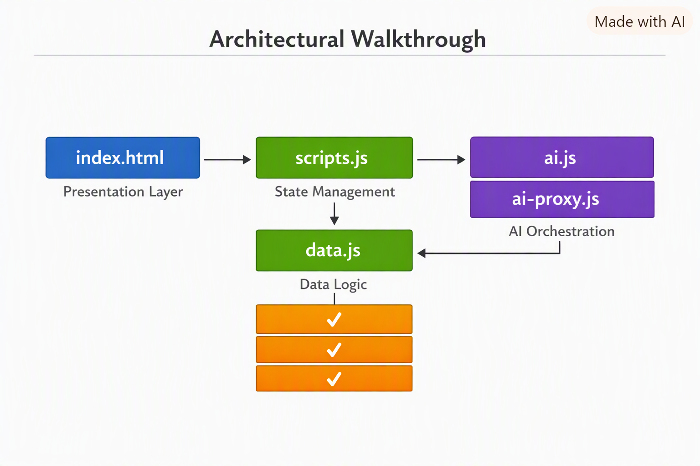

# TraceDiary Technical Compliance, Architecture & Code Quality Report

### 1. Executive Summary & Project Definition

#### 1.1 Purpose & Domain Scope

TraceDiary is a specialized, mobile-responsive web application designed to capture, track, and resolve domain-specific execution errors encountered during quantitative trading and algorithmic development workflows. The system targets quantitative developers and algorithmic traders operating across five core operational categories defined in `data.js` via `CATEGORY_OPTIONS`: `"MQL5"`, `"Data Pipeline"`, `"Backtesting"`, `"Infrastructure"`, and `"JavaScript"`.

This domain scope is operationalized through structured data schemas in `data/entries.json`. The application records precise technical failure modes, including MQL5 Expert Advisor runtime halts, high-frequency tick data resampling crashes in Python streaming pipelines, lookahead bias in `vectorbt` backtesting engines, and database worker connection exhaustion in PostgreSQL infrastructure. Each entry enforces a structured troubleshooting breakdown across nine standardized fields—`id`, `timestamp`, `category`, `title`, `symptom`, `tried`, `rootCause`, `fix`, and `lesson`—enabling practitioners to systematically document root causes, isolate dead ends, and prevent recurrence.

_Figure 1.1 — The five operational categories defined by `CATEGORY_OPTIONS` in `data.js`, mapped to representative failure modes drawn from `data/entries.json`._

#### 1.2 Technical Stack & Constraints

TraceDiary is architected as a lightweight, framework-free single-page web application using standard vanilla ECMAScript 2015+ (ES6+), HTML5, and CSS3. The client-side application strictly avoids full-featured JavaScript UI frameworks such as React, Vue, or Angular. Instead, DOM manipulation, state synchronization, and event handling are implemented through native Web APIs in `scripts.js` and `data.js`. The RESTful API backend is provided by `json-server` (version `1.0.0-beta.15`), configured in `package.json` to serve `data/entries.json` on port 3000.

External third-party integration is restricted to targeted library utilities loaded via CDN links in `index.html`. Asynchronous REST network calls are executed using the Axios HTTP client (`axios.create({ timeout: 8000 })`), while the user interface leverages Bootstrap 5 (`bootstrap.bundle.min.js`) for responsive layouts. Enhanced UI interaction and rendering are augmented by SweetAlert2 (`Swal` dialogs), Marked.js, and DOMPurify for sanitizing AI-generated Markdown feedback without introducing heavy client-side frameworks.

_Figure 1.2 — The framework-free client stack, bounded third-party CDN integrations, and external service boundary._

---

### 2. Module Assessment & Syllabus Compliance Audit

#### 2.1 Learning Outcomes Audit (LO4–LO12)

TraceDiary satisfies all target learning outcomes (LO4–LO12) through native client-side JavaScript execution and structured server communication. Variable manipulation and control flow (**LO4**) are demonstrated in `scripts.js` using a `while` loop to enforce console length limits (`MAX_CONSOLE_LINES`).

Complex state management (**LO5**) relies on the in-memory `entriesState` array store in `data.js` alongside lookup objects like `SORTERS`. Functional composition (**LO6**) is established by passing function return values directly as arguments to downstream routines, such as `filterAndSortEntries()` inside `applyFilters()`.

DOM selection and element mutation (**LO7**) occur via `entriesList.replaceChildren(...)`, avoiding `innerHTML` re-parsing overhead. Event-driven architecture (**LO8**) binds UI actions utilizing event delegation (`entriesList.addEventListener("click", handleListClick)`). Responsive design (**LO9**) adapts layouts using viewport media queries.

Asynchronous promise handling (**LO10**) and network requests (**LO11**) use an Axios client configured in `data.js`. Finally, RESTful endpoint consumption (**LO12**) covers local `json-server` CRUD operations and integration with a Generative AI SaaS provider for automated log reviews via `ai.js` and `ai-proxy.js`.

_Figure 2.1 — Learning outcome coverage mapped to concrete file → symbol evidence._

#### 2.2 Rubric Benchmark Evaluation

TraceDiary meets all mandatory grading criteria specified in the module assessment rubric. The target audience pain point is addressed by establishing a domain-specific schema across nine required fields.

DOM mutations directly update node properties across list, detail, and console views, modifying `textContent`, `className`, `innerHTML`, `dataset`, `hidden`, and ARIA attributes. Event handling covers a comprehensive suite of UI listeners. Control flow includes strict comparisons, logical operators, conditional branching, iteration, and state mutations.

Full resource CRUD operations run asynchronously via Axios, ensuring Create (`createEntry()`), Read (`fetchEntries()`), Update (`updateEntry()`), and Delete (`deleteEntry()`) lifecycle management against the `/entries` endpoint.

---

### 3. Architectural Walkthrough & System Topology

#### 3.1 Modular Separation of Concerns

TraceDiary segregates responsibilities across specialized application files to maintain a strict boundary between the data layer and user interface. `scripts.js` is exclusively responsible for presentation logic and event orchestration. It deliberately defers HTTP network communication to `data.js`, which encapsulates internal state management and REST operations. The Generative AI review workflow is also isolated; UI triggers delegate execution to `requestAiReview()` in `ai.js`, which communicates with the backend `requestReview()` logic via `ai-proxy.js`. Structural elements remain confined to `index.html`.

#### 3.2 Data Model & Schema Validation

The application enforces a strict data schema requiring nine standardized fields for every troubleshooting record. Form ingestion relies on the `FORM_FIELDS` array to map these keys, while the `category` attribute is restricted to a specific enumeration defined by `CATEGORY_OPTIONS`. During the creation phase, dynamic payload construction ensures data integrity; the data layer automatically generates an ISO 8601 UTC timestamp before transmission, eliminating localized timezone anomalies.

#### 3.3 Data Layer & State Store Topology (`data.js`)

`data.js` functions as the application's single source of truth, managing a private global array named `entriesState`. External UI components access it via the `getEntries()` accessor function. The Axios client enforces a strict 8-second timeout to prevent infinite hanging states. Additionally, the network ingestion pipeline implements defensive runtime type guarding, explicitly verifying payloads using `Array.isArray(data)`.

#### 3.4 UI Controller Logic & Rendering Pipeline (`scripts.js`)

The rendering pipeline mitigates performance bottlenecks by manipulating cached DOM references. List updates leverage the native `replaceChildren()` method, which swaps the node tree in a single operation. Search functionality is buffered by a 250-millisecond delay (`SEARCH_DEBOUNCE_MS`). Memory overhead is optimized via the Event Delegation pattern; instead of binding unique listeners to every individual entry card, a single listener is attached to the parent `entriesList` container.

#### 3.5 Generative AI Integration & Markdown Rendering

TraceDiary integrates an external Generative AI SaaS provider for automated log evaluation without compromising system security. The interaction delegates an asynchronous call to `requestAiReview()`. As documented in the `"TraceDiary project - 1st cut_10"` documentation, the raw AI Markdown response is safely sanitized via `DOMPurify.sanitize()` and parsed to HTML before injection into the detail pane, neutralizing XSS threats.

#### 3.6 REST API & Communication Lifecycle

The system dictates a highly structured end-to-end data lifecycle. `scripts.js` intercepts native form submissions, calls `collectEntryFormPayload()`, and validates inputs via `getMissingFields()`. It then dispatches an asynchronous request (`createEntry` or `updateEntry`). Once the mock server successfully processes the request, `data.js` synchronizes the `entriesState` array, and control returns to `scripts.js` to execute `applyFilters()` for dynamic DOM re-rendering.

_Figure 3.1 — File-level separation of concerns and directional dependency flow._

---

### 4. Code Quality, Engineering Patterns & Security Audit

#### 4.1 Security & Input Sanitization

The application enforces a multi-layer defense strategy to prevent Cross-Site Scripting (XSS). User-generated content is neutralized prior to DOM template interpolation using the `escapeHtml()` utility function, ensuring the browser evaluates malicious characters as text nodes. Furthermore, AI-generated feedback is scrubbed by `DOMPurify.sanitize()` to ensure any arbitrary scripts embedded within LLM outputs are structurally neutralized.

#### 4.2 Performance & Memory Optimization

The codebase minimizes main-thread blocking through explicit DOM optimizations. Rather than iterative `removeChild()` loops, `scripts.js` utilizes `replaceChildren()`. Memory utilization within the on-screen console is capped using a FIFO buffer governed by the `MAX_CONSOLE_LINES` limit. Finally, Event Delegation is leveraged on the `entriesList` container to optimize listener memory overhead.

#### 4.3 Error Handling, Network Resilience & Graceful UI Degradation

TraceDiary implements categorized error capture mechanisms via `describeRequestError()`, distinguishing HTTP response codes, defensive type-guard failures (`unexpectedShape`), timeouts (`ECONNABORTED`), and unreachable API endpoints. Global safety nets listen to `unhandledrejection` events. The UI exhibits graceful degradation; functions like `showErrorDialog()` and `confirmDelete()` perform runtime defensive checks (`typeof Swal === "undefined"`) to fall back to native browser dialogs if SweetAlert2 fails to load.

#### 4.4 Code Structure & Functional Patterns

The architecture prioritizes functional patterns and state immutability. Utility operations operate as pure functions. The application strictly enforces immutable array operations (e.g., `[...entries]` in `sortEntries()`). Control flow relies heavily on function chaining, and interactive routines employ delegated event target matching via `event.target.closest(".entry-card")`.

---

### 5. UI/UX Design, Accessibility & Responsive Architecture

#### 5.1 Responsive Split-Pane Mechanics

Dynamic layout adaptation is handled using Bootstrap 5 grid systems and standard Web APIs. The `MOBILE_QUERY` object (`window.matchMedia("(max-width: 767.98px)")`) listens to viewport dimensions to seamlessly toggle between dual-pane desktop split views and single-pane mobile list/detail view transitions.

#### 5.2 Accessibility, ARIA Compliance & Global Keyboard Shortcuts

Full keyboard operability is maintained using `role="button"` and `tabindex="0"`, with `aria-live="polite"` applied to live console regions. Defensive focus management (`blurEntryModalFocus`) prevents ARIA hidden focus leaks. Furthermore, a `handleGlobalKeydown` listener enforces global shortcuts, allowing users to press `Escape` to dismiss views or `n` to open the creation modal (defensively checking `isTypingTarget` to prevent misfires).

#### 5.3 Theme Engine & Visual Styling

TraceDiary utilizes CSS custom properties to bind colors to categories (`[data-category]`). It supports dark and light modes through a preference persistence layer managed via `localStorage` and `applyTheme()`, ensuring immediate inline execution to prevent a Flash of Unstyled Theme (FOUC).

---

### 6. Deliverables Checklist & Assessment Readiness

#### 6.1 Repository File Structure & Setup

The repository presents a clean, framework-free architecture adhering strictly to module requirements. The core layer is composed of `index.html` and `style.css`. Logic is securely segregated into specialized modules (`scripts.js`, `data.js`, `ai.js`). The submission includes `package.json` for the `json-server` dependency and pre-populates `data/entries.json`.

#### 6.2 Submission Packaging

The required mock backend is instantiated using the `npm run mock-api` script in `package.json`. The `--host 0.0.0.0` flag ensures the API remains accessible through GitHub Codespaces. The `--middlewares ./ai-proxy.js` flag securely attaches the backend proxy to shield the `DEEPSEEK_API_KEY`. Students submitting the LMS `.zip` archive must exclude the `.env` file and `node_modules/` directory.

#### 6.3 Oral Assessment Strategy

Candidates preparing for the oral defense session must be ready to articulate architectural decisions. They should explain the Event Delegation pattern (`entriesList.addEventListener("click", handleListClick)`), asynchronous state management (`axios.create({ timeout: 8000 })`), and runtime type guarding (`Array.isArray(data)`). Finally, candidates must confidently walk through the Generative AI integration pipeline, emphasizing XSS mitigation via DOMPurify.
