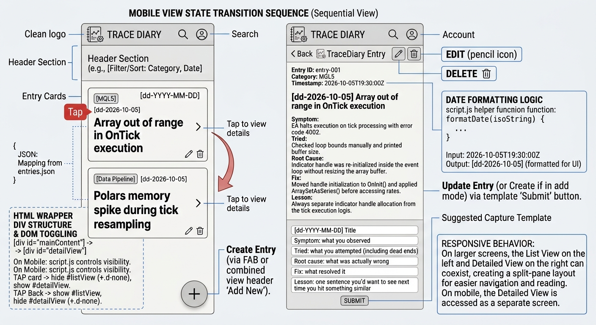

# TraceDiary: Project Specification

## 1. Project Definition

- **Project Name:** TraceDiary
- **Target User:** Quantitative developers and algorithmic traders.
- **Problem Statement:** Complex trading architectures involving MQL5 expert advisors, Python backtesting pipelines, and high-frequency tick data processing often generate obscure logic errors or execution anomalies. TraceDiary provides a streamlined, mobile-responsive interface to log these symptoms, track dead ends during troubleshooting, and build a searchable repository of root causes and fixes for future reference.

---

## 2. Repository & Folder Structure

Workflow: create the GitHub repository first, clone it into WSL, and open it in Visual Studio Code.

```
TraceDiary/
├── index.html          # Main structural entry point
├── style.css           # Custom CSS overrides not handled by Bootstrap
├── scripts.js          # Application logic (DOM, events, CRUD, API calls)
├── data.js             # Data layer (state array, API endpoint configuration)
├── db.json             # JSON Server data file, shape defined in section 5
├── entries.schema.json # Design-time JSON Schema, defined in section 5
└── README.md           # Project overview, setup steps, and data dictionary for the assessor
```

---

## 3. Interface (Bootstrap 5)

Bootstrap 5 provides the layout and styling and satisfies the requirement that the app is **mobile-responsive for at least one mobile device** (document the tested device in the README).

### 3.1 Mobile Wireframe



### 3.2 Form

Use Bootstrap form controls (`form-control`, `mb-3`) for the entry fields:

| Field | Control |
|---|---|
| Category | `<select>` (MQL5, Data Pipeline, Backtesting, Infrastructure) |
| Title | text input |
| Symptom | textarea |
| Tried | textarea |
| Root Cause | textarea |
| Fix | textarea |
| Lesson | text input |

The six core fields are Title, Symptom, Tried, Root Cause, Fix, and Lesson. Category is a seventh field that acts as the tag.

### 3.3 Display

Render saved logs as Bootstrap Cards. Each card must include an **Edit** button and a **Delete** button.

### 3.4 Icons

Load Bootstrap Icons:

```html
<link rel="stylesheet" href="https://cdn.jsdelivr.net/npm/bootstrap-icons@1.11.3/font/bootstrap-icons.min.css" />
```

**Logo** (`bi-journal-code` is the primary choice)

```html
<i class="bi bi-journal-code me-2"></i> TRACE DIARY
```

Alternatives: `bi-bug-fill`, `bi-terminal-split`, `bi-graph-up-arrow`.

**Account**

```html
<i class="bi bi-person-circle"></i>
```

Alternatives: `bi-person-badge`, `bi-person-gear`.

**CRUD operations**

| Operation | Icon | Use |
|---|---|---|
| Create | `bi-plus-lg` | Floating Action Button (FAB) for a new entry |
| Read | `bi-search` | Search and filter log history in the header |
| Update | `bi-pencil` | Edit an entry |
| Delete | `bi-trash3` | Remove an entry |

```html
<i class="bi bi-plus-lg"></i>   <!-- Create -->
<i class="bi bi-search"></i>    <!-- Read / Search -->
<i class="bi bi-pencil"></i>    <!-- Update -->
<i class="bi bi-trash3"></i>    <!-- Delete -->
```

**Categories**

| Category | Icon |
|---|---|
| MQL5 / Expert Advisors | `bi-cpu` |
| Data Pipeline | `bi-diagram-3` or `bi-database` |

**Structured fields**

| Field | Icon |
|---|---|
| Symptom | `bi-exclamation-triangle` |
| Tried | `bi-tools` or `bi-lightbulb` |
| Root Cause | `bi-diagram-2` or `bi-tree` |
| Fix | `bi-check2-circle` or `bi-wrench-adjustable` |
| Lesson | `bi-bookmark-star` |

**Navigation and layout**

| Purpose | Icon |
|---|---|
| Filter by category | `bi-funnel` |
| Sort chronologically | `bi-sort-down` |
| Entry tap indicator (mobile list) | `bi-chevron-right` |
| Back to list (mobile detail) | `bi-arrow-left` |

---

## 4. JavaScript Implementation (CRUD & API)

The assessment grades vanilla JavaScript proficiency. Build Create, Read, Update, and Delete while meeting these milestones:

1. **State management (arrays and objects):** Define the entries array in `data.js`. Each entry is a JavaScript object with the fields in section 5.
2. **DOM manipulation and events:** Use `document.addEventListener("DOMContentLoaded", ...)` as the entry point. Attach a `submit` listener to the form. Modify at least three properties across two DOM elements (for example text content, a class, or hiding/showing an element).
3. **Structured logic:**
   - at least one loop (rendering entries)
   - at least one conditional branch (validating that required fields are not empty)
   - custom functions where the return value of one is passed to another
4. **Asynchronous operations (AJAX):** Use Axios to communicate with an external service. Implement at least one `GET` request to retrieve logs and at least one `POST`, `PUT`, or `PATCH` request to save or update them.

**API:** JSON Server serves `db.json` at `http://localhost:3000/entries` (endpoint configured in `data.js`).

---

## 5. Data Model

### 5.1 JSON Schema (`entries.schema.json`)

Design-time blueprint of the dataset. It documents the structure without relying on runtime data.

```json
{
  "$schema": "https://json-schema.org/draft/2020-12/schema",
  "$id": "https://example.com/entries.schema.json",
  "title": "Log Entries Dataset",
  "description": "Schema for recording technical development logs, errors, and lessons learned.",
  "type": "object",
  "properties": {
    "entries": {
      "type": "array",
      "description": "A collection of troubleshooting and engineering log records.",
      "items": {
        "type": "object",
        "properties": {
          "id": {
            "type": "string",
            "description": "Unique identifier for the entry record."
          },
          "timestamp": {
            "type": "string",
            "format": "date-time",
            "description": "Date and time the log was generated, in ISO 8601 UTC format."
          },
          "category": {
            "type": "string",
            "description": "The technology stack, domain, or environment related to the issue.",
            "enum": ["MQL5", "Data Pipeline", "Backtesting", "Infrastructure"]
          },
          "title": {
            "type": "string",
            "description": "A brief synopsis of the bug or milestone."
          },
          "symptom": {
            "type": "string",
            "description": "The visible error, logs, or system behavior noticed."
          },
          "tried": {
            "type": "string",
            "description": "Troubleshooting attempts and isolated experiments performed."
          },
          "rootCause": {
            "type": "string",
            "description": "The underlying technical explanation for why the bug occurred."
          },
          "fix": {
            "type": "string",
            "description": "The code or system change applied to resolve the problem."
          },
          "lesson": {
            "type": "string",
            "description": "Key takeaway or architectural note to avoid recurrence."
          }
        },
        "required": ["id", "timestamp", "category", "title", "symptom", "tried", "rootCause", "fix", "lesson"],
        "additionalProperties": false
      }
    }
  },
  "required": ["entries"],
  "additionalProperties": false
}
```

### 5.2 Data Dictionary

**Top-level structure**

- `entries` (array of objects): mandatory list of recorded logs.

**Entry item properties**

| Field | Type | Format / Constraints | Required | Description |
|---|---|---|---|---|
| `id` | String | Unique alphanumeric string | Yes | Unique identifier for the entry. |
| `timestamp` | String | ISO 8601 UTC (`YYYY-MM-DDTHH:MM:SSZ`) | Yes | When the record was created. |
| `category` | String | One of: `MQL5`, `Data Pipeline`, `Backtesting`, `Infrastructure` | Yes | Technical domain of the log. |
| `title` | String | Plain text | Yes | Short title describing the scope of the log. |
| `symptom` | String | Plain text | Yes | Observable errors, console output, or crashes. |
| `tried` | String | Plain text | Yes | Actions taken before the cause was found. |
| `rootCause` | String | Plain text | Yes | Core reason behind the failure. |
| `fix` | String | Plain text | Yes | Steps taken to resolve the issue. |
| `lesson` | String | Plain text | Yes | Best-practice takeaway from the event. |